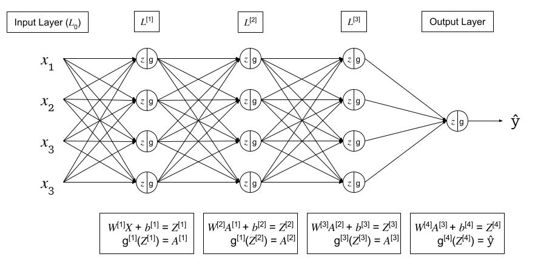

## # Intuition about deep representation

- shallower nueral networks need exponentially more ($2^{n-1}$) more hidden units vs. a "small" L-layer deep neural network to compute the same function.

## Forward and Backward Functions

Given the following generic deep neural network,

{fig-alt="Generic Deep Neural Network"}

For each layer $l$: $W^{[l]}$, $b^{[l]}$

**Forward Pass**: 
 
- Input: $A^{[l-1]}$
- Output: $A^{[l]}$, where:
    - $Z^{[l]} = W^{[l]}A^{[l-1]} + b^{[l]}$ (cache for backward pass)
    - $A^{[l]} = g^{[l]}(Z^{[l]})$

**Backward Pass**:

- Input: $dA^{[l]}$
- Output: $dA^{[l-1]}$, $dW^{[l]}$, $db^{[l]}$, where:
    - $dZ^{[l]} = A^{[l]} - Y$
    - $dW^{[l]} = \frac{1}{m} dZ^{[l]} A^{[l-1] \top}$
    - $db^{[l]} = \frac{1}{m} \sum^m dZ^{[l]}$
    - $dA^{[l-1]} = W^{[l]\top}  dZ^{[l]}$
    - $dZ^{[l-1]} = dA^{[l-1]} * g^{\prime [l-1]} (Z^{[l-1]}) = W^{[l]\top}  dZ^{[l]} * g^{\prime [l-1]} (Z^{[l-1]})$

### Feed Forward Neural Networks Derivations

- [(1) Forward and Backward Propagations](https://jonaslalin.com/2021/12/10/feedforward-neural-networks-part-1/)
- [(2) Activation Functions](https://jonaslalin.com/2021/12/21/feedforward-neural-networks-part-2/)
- [(3) Cost Functions](https://jonaslalin.com/2021/12/22/feedforward-neural-networks-part-3/)

## Parameters & Hyperparameters

**Parameters**: 

- $W^{[l]}$
- $b^{[l]}$

**Hyperparameters**: the parameters that control the Parameters $W$ and $b$

- $\alpha$ - learning rate
- learning rate decay
- num iterations
- $L$ - num hidden layers
- $n^{[l]}$ - num hidden units
- $g^{[l]}$  - activation functions
- Momentum
- $\mathcal{B}$ - minibatch size
- regularization

### How to learn hyperparamters?

In deep learning, there can be many hyperparameters.  With a small amount of hyperparameters, a grid search can be conducted. In deep learning, there can be many hyperparameters, and a grid search becomes untenable.  Instead, sampling at random, more unique values are able to be searched.

When searching hyperparamters, a common technique is to first conduct a coarse search over a larger range of values.  Then a fine search can be conducted on a smaller region.

## Regularization

### Bias vs. Variance Tradeoff

Intro to regularization.
- Why regularization
- What is regularization?

### L1 Regularization

{Visualization}
{Pytorch Example}

**Summary**

### L2 Regularization

{Visualization}
{Pytorch Example}

**Summary**

### Elastic Net Regularization

{Visualization}
{Pytorch Example}

**Summary**

### Dropout

Dropout is where, during training, some % of neurons in each layer are zeroed out or "dropped".  The neurons dropped change each batch.  Dropout prevents units from co-adapting too much to the data and acts as a sampling strategy since we drop a different set of neurons each time.  It effectively forces the net to learn the data without cheating.

{Visualization}
{Pytorch Example}

**Summary**

- only used during training

### Batch Normalization

{Visualization}
{Pytorch Example}

**Summary**
- check notes from NN Zero to Heroon this

### Other?

## Activation Functions

### Sigmoid

### ReLU

### Argmax

### Softmax

Softmax regression generalizes logistic regression to $C$ classes.  If $C=2$, the softmax reduces to logisitc regression.
Softmax is named from the contrast to "Hardmax" or Argmax function.

$$
\text{Softmax}(x_i) = \frac{\text{exp}(x_i)}{\sum_j \text{exp}(x_j)}
$$

- used for multiclass classification
- normalizes outputs to sum to 1
- output can be interpreted as probabilities

**Loss Function**

$$
\begin{align}
\mathcal{L}(\hat{y}, y) &= - \sum^n_{j=1} y_j \text{log} \hat{y}_j \
&= -y_{j=c} \text{log} \hat{y_{j=c}} \
&= - \text{log}\hat{y}_{j=c}
\end{align}
$$

Where:
- $j=c$ is the true label of the class
- the summation goes away because all other class outputs are $0$

**Cost Function**
$$
\mathcal{J}(W^{[l]}, b^{[l]}, ...) = \frac{1}{m} \sum^m_{i=1} \mathcal{L} (\hat{y}^i, y^i)
$$

## Optimizers

### Gradient Descent

### Stochastic Gradient Descent

### ADAM

